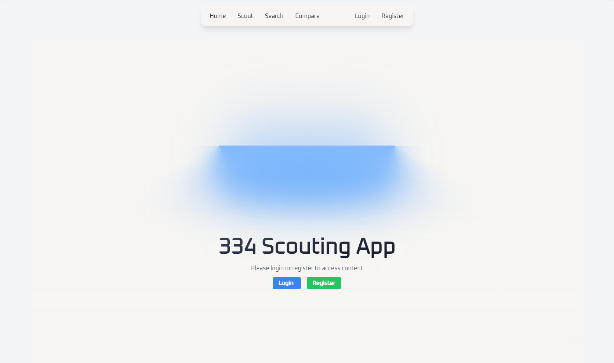
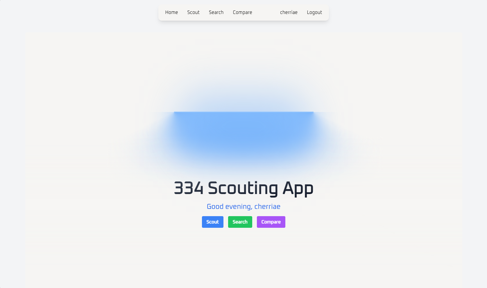
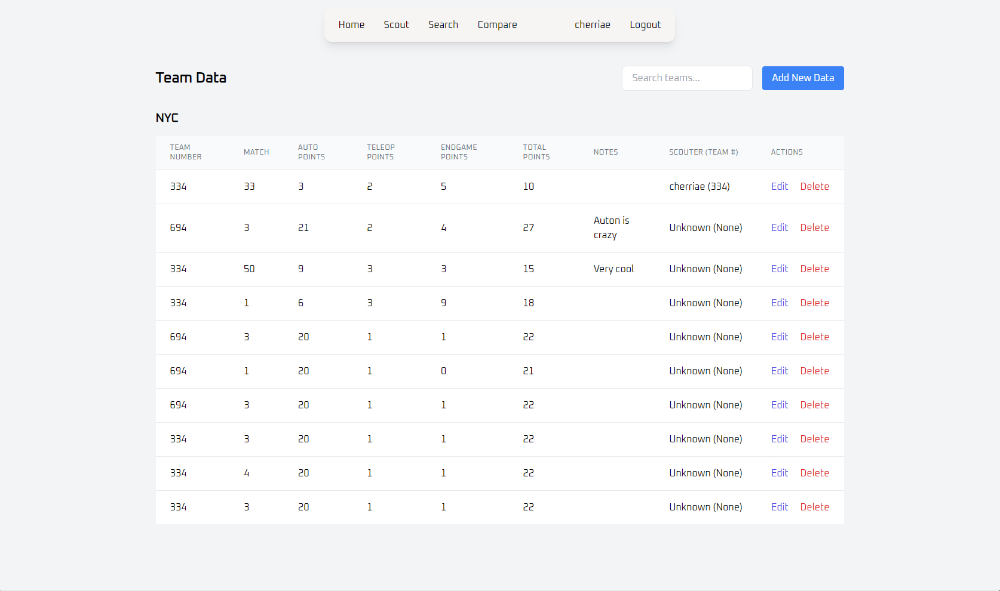
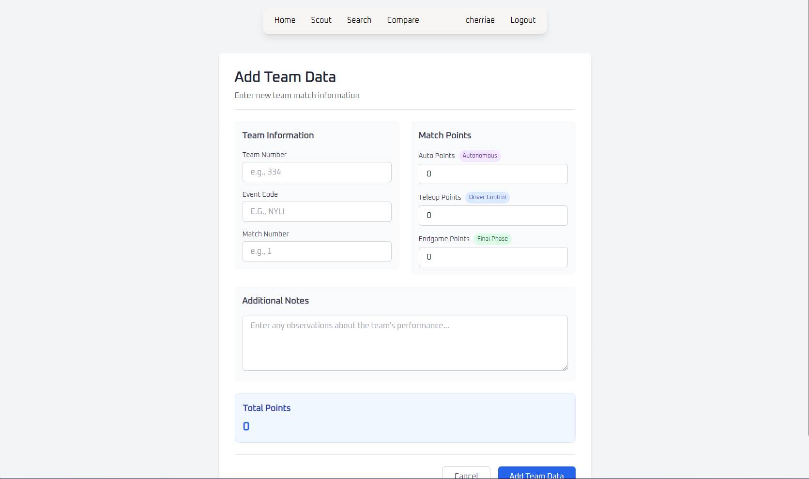
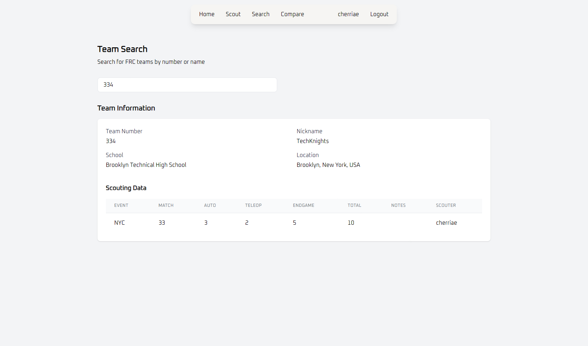
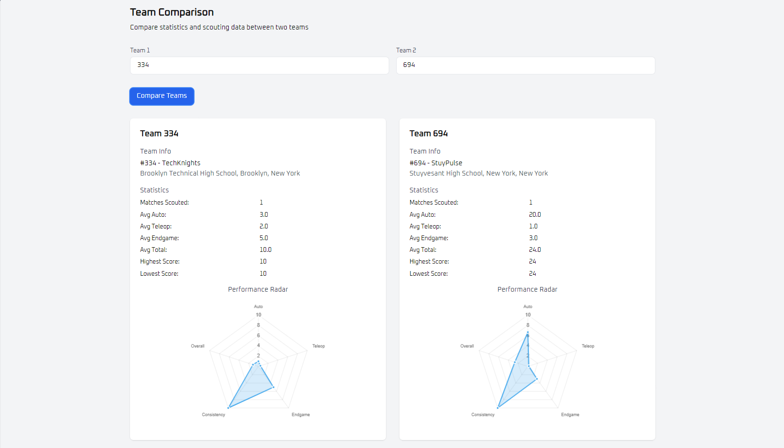

# 334 Scouting App

| Images | Images |
| ---- | ----- |
|  |  |
|  |  |
|  |  |

## Prerequisite
- [MongoDB compass](https://www.mongodb.com/try/download/community) - https://www.mongodb.com/try/download/community
- [Python](https://python.org) - https://python.org


## How to install
1. Clone the repo
2. Create a database in [MongoDB compass](https://www.mongodb.com/try/download/community):


3. Create `.env` file in root directory, should look similar to this
```
SECRET_KEY=your_secret_key
MONGO_URI=mongodb://localhost:27017/scouting_app
TBA_AUTH_KEY=your_tba_api_key
DEBUG=False
```
4. Make a virtual environment: `python -m venv venv`
  - To activate (type into command line):
    - Windows:
      - Cmd: `venv\Scripts\activate`
      - Powershell: `venv\Scripts\Activate.ps1`
    - MacOS & Linux: `source ./venv/bin/activate`
6. Install the dependencies: `pip install -r requirements.txt`
7. Run the app through (in parent directory outside of app): `python app/app.py`
