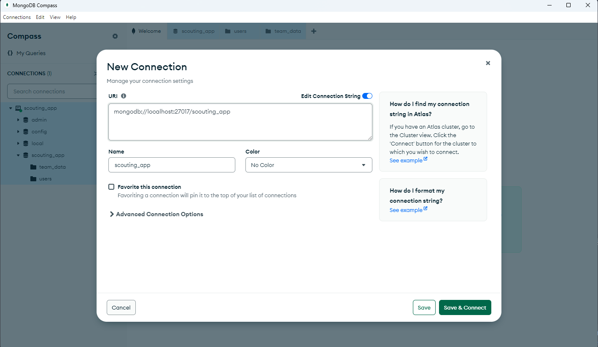

# Castle
> The Official Scouting App Presented By Team 334

https://github.com/user-attachments/assets/09c607ce-628d-41e6-ab82-b5fb1a4ec928


## Prerequisite
- [MongoDB compass](https://www.mongodb.com/try/download/community) - https://www.mongodb.com/try/download/community
- [Python](https://python.org) - https://python.org


## How to install
> Raspberry PI Local Install https://docs.google.com/document/d/1M9b2T-DrkaLq0EBT1hQqs_XhuhEjtLw3hJQsBVWiQsk/edit?usp=sharing 
1. Clone the repo: `git clone https://github.com/team334/Castle`
2. Create a database in [MongoDB compass](https://www.mongodb.com/try/download/community):



3. Create `.env` file in root directory, should look similar to this
```
SECRET_KEY=your_secret_key
MONGO_URI=mongodb://localhost:27017/scouting_app
TBA_AUTH_KEY=your_tba_api_key
DEBUG=False
HOST=localhost
PORT=5000
VAPID_PUBLIC_KEY=your_vapid_public_key
VAPID_PRIVATE_KEY=your_vapid_private_key
VAPID_CLAIM_EMAIL=mailto:your-email@example.com
```
> To generate VAPID keys, read here: https://github.com/web-push-libs/vapid/blob/main/python/README.md

4. Make a virtual environment: `python -m venv venv`
  - To activate (type into command line):
    - Windows:
      - Cmd: `venv\Scripts\activate`
      - Powershell: `venv\Scripts\Activate.ps1`
    - MacOS & Linux: `source ./venv/bin/activate`
6. Install the dependencies: `pip install -r requirements.txt`
7. Run the app through (in parent directory outside of app): `python -m app`
