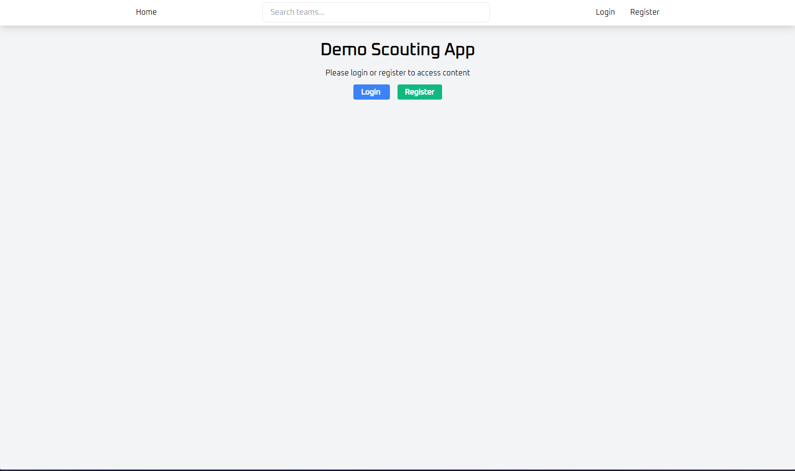

# Scouting App Demo
> This is just made for fun

## How to install
1. Clone the repo
2. Inside of `app` folder, create a folder called `db` and inside `db` folder create a file named `tortoise.db`
3. Install the dependencies: `pip install -r requirements.txt`
4. Run the app through (in parent directory outside of app): `python app/app.py`